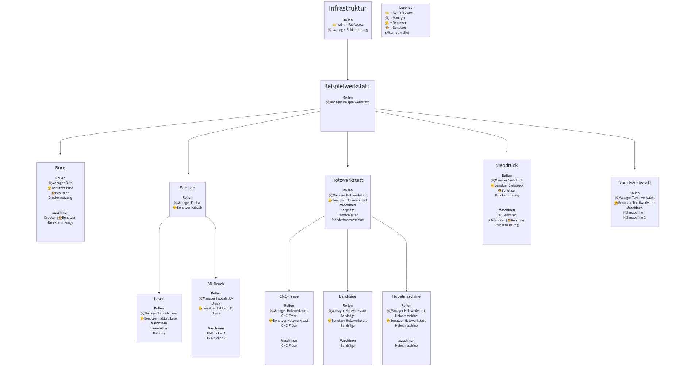

Python-Skript zur automatische Generierung von Maschinen, Rollen, Aktoren und Aktor-Verbindungen auf Basis einer Maschinenliste im CSV-Format.

## Funktionsumfang

- Generierung von Maschinen
- Generierung von Rollen
- Generierung von Aktoren
- Generierung von einfachen Aktoren-Verbindungen
- Export einer gesonderten Rollenliste (interne ID & Anzeigename der Rolle)
- Abbildung der Struktur mittels Mermaid-Diagramm
- Direkte Aktualisierung einer bestehenden bffh.dhall

## Beispieldaten
=== "CSV-Eingabedaten (Auszug)"

    | Name Domäne       | Name Bereich    | Name Unterbereich | Name Maschine       | Manager Unterbereich | Name Alternativrolle |
    | ----------------- | --------------- | ----------------- | ------------------- | -------------------- | -------------------- |
    | Beispielwerkstatt | Holzwerkstatt   | Bandsäge          | Bandsäge            |                      |                      |
    | Beispielwerkstatt | Holzwerkstatt   | Hobelmaschine     | Hobelmaschine       |                      |                      |
    | Beispielwerkstatt | Holzwerkstatt   | CNC-Fräse         | CNC-Fräse           |                      |                      |
    | Beispielwerkstatt | Holzwerkstatt   |                   | Kappsäge            |                      |                      |
    | Beispielwerkstatt | Holzwerkstatt   |                   | Bandschleifer       |                      |                      |
    | Beispielwerkstatt | Holzwerkstatt   |                   | Ständerbohrmaschine |                      |                      |
    | Beispielwerkstatt | Textilwerkstatt |                   | Nähmaschine 1       |                      |                      |
    | Beispielwerkstatt | Textilwerkstatt |                   | Nähmaschine 2       |                      |                      |
    | Beispielwerkstatt | FabLab          | 3D-Druck          | 3D-Drucker 1        | x                    |                      |
    | Beispielwerkstatt | FabLab          | 3D-Druck          | 3D-Drucker 2        | x                    |                      |
    | Beispielwerkstatt | FabLab          | Laser             | Lasercutter         | x                    |                      |
    | Beispielwerkstatt | FabLab          | Laser             | Kühlung             | x                    |                      |
    | Beispielwerkstatt | Siebdruck       |                   | SD-Belichter        |                      |                      |
    | Beispielwerkstatt | Siebdruck       |                   | A3-Drucker          |                      | Druckernutzung       |
    | Beispielwerkstatt | Büro            |                   | Drucker             |                      | Druckernutzung       |

=== "Erzeugte Rollen"

		Admin = {
			permissions =  [
				"bffh.users.manage",
				"bffh.users.info",
				"bffh.users.admin",
				"beispielw.*",
			]
		},
 
		_manager_schichtleitung = {
			permissions =  [
				"beispielw.*",
			]
		},
 
		beispielw_holz_manager = {
			permissions =  [
				"beispielw.holz.*",
			]
		},
 
		beispielw_holz_bandsaege_user = {
			permissions =  [
				"beispielw.holz.bandsaege.disclose.*",
				"beispielw.holz.bandsaege.read.*",
				"beispielw.holz.bandsaege.write.*",
			]
		},
 
		beispielw_holz_hobelmaschine_user = {
			permissions =  [
				"beispielw.holz.hobelmaschine.disclose.*",
				"beispielw.holz.hobelmaschine.read.*",
				"beispielw.holz.hobelmaschine.write.*",
			]
		},
 
		beispielw_holz_holzcnc_user = {
			permissions =  [
				"beispielw.holz.holzcnc.disclose.*",
				"beispielw.holz.holzcnc.read.*",
				"beispielw.holz.holzcnc.write.*",
			]
		},
 
		beispielw_holz_user = {
			permissions =  [
				"beispielw.holz.disclose.*",
				"beispielw.holz.read.*",
				"beispielw.holz.write.*",
			]
		},
 
		beispielw_textil_manager = {
			permissions =  [
				"beispielw.textil.*",
			]
		},
 
		beispielw_textil_user = {
			permissions =  [
				"beispielw.textil.disclose.*",
				"beispielw.textil.read.*",
				"beispielw.textil.write.*",
			]
		},
 
		beispielw_fablab_manager = {
			permissions =  [
				"beispielw.fablab.*",
			]
		},
 
		beispielw_fablab_3dprint_manager = {
			permissions =  [
				"beispielw.fablab.3dprint.*",
			]
		},
 
		beispielw_fablab_3dprint_user = {
			permissions =  [
				"beispielw.fablab.3dprint.disclose.*",
				"beispielw.fablab.3dprint.read.*",
				"beispielw.fablab.3dprint.write.*",
			]
		},
 
		beispielw_fablab_laser_manager = {
			permissions =  [
				"beispielw.fablab.laser.*",
			]
		},
 
		beispielw_fablab_laser_user = {
			permissions =  [
				"beispielw.fablab.laser.disclose.*",
				"beispielw.fablab.laser.read.*",
				"beispielw.fablab.laser.write.*",
			]
		},
 
		beispielw_siebdruck_manager = {
			permissions =  [
				"beispielw.siebdruck.*",
			]
		},
 
		beispielw_siebdruck_user = {
			permissions =  [
				"beispielw.siebdruck.disclose.*",
				"beispielw.siebdruck.read.*",
				"beispielw.siebdruck.write.*",
			]
		},
 
		beispielw_drucker = {
			permissions =  [
				"beispielw.siebdruck.disclose.a3drucker",
				"beispielw.siebdruck.read.a3drucker",
				"beispielw.siebdruck.write.a3drucker",
				"beispielw.buero.disclose.drucker",
				"beispielw.buero.read.drucker",
				"beispielw.buero.write.drucker",
			]
		},
 
		beispielw_buero_manager = {
			permissions =  [
				"beispielw.buero.*",
			]
		},

=== "Erzeugte Maschinen"

        beispielw-holz-bandsaege-bandsaege = {
			name = "Bandsäge",
			description = "Bandsäge im Holzbereich",
			wiki = "",
			category = "Holzwerkstatt",
			disclose = "beispielw.holz.bandsaege.disclose.bandsaege",
			read = "beispielw.holz.bandsaege.read.bandsaege",
			write = "beispielw.holz.bandsaege.write.bandsaege",
			manage = "beispielw.holz.bandsaege.manage.bandsaege",
		},
 
		beispielw-holz-hobelmaschine-hobelmaschine = {
			name = "Hobelmaschine",
			description = "Hobelmaschine im Holzbereich",
			wiki = "",
			category = "Holzwerkstatt",
			disclose = "beispielw.holz.hobelmaschine.disclose.hobelmaschine",
			read = "beispielw.holz.hobelmaschine.read.hobelmaschine",
			write = "beispielw.holz.hobelmaschine.write.hobelmaschine",
			manage = "beispielw.holz.hobelmaschine.manage.hobelmaschine",
		},
 
		beispielw-holz-holzcnc-holzcncfraese = {
			name = "CNC-Fräse",
			description = "CNC Fräse im Holzbereich",
			wiki = "",
			category = "Holzwerkstatt",
			disclose = "beispielw.holz.holzcnc.disclose.holzcncfraese",
			read = "beispielw.holz.holzcnc.read.holzcncfraese",
			write = "beispielw.holz.holzcnc.write.holzcncfraese",
			manage = "beispielw.holz.holzcnc.manage.holzcncfraese",
		},
 
		beispielw-holz-kappsaege = {
			name = "Kappsäge",
			description = "Kappsäge mit allgemeiner Einweisung Holz",
			wiki = "",
			category = "Holzwerkstatt",
			disclose = "beispielw.holz.disclose.kappsaege",
			read = "beispielw.holz.read.kappsaege",
			write = "beispielw.holz.write.kappsaege",
			manage = "beispielw.holz.manage.kappsaege",
		},
 
		beispielw-holz-bandschleifer = {
			name = "Bandschleifer",
			description = "Bandschleifer mit allgemeiner Einweisung Holz",
			wiki = "",
			category = "Holzwerkstatt",
			disclose = "beispielw.holz.disclose.bandschleifer",
			read = "beispielw.holz.read.bandschleifer",
			write = "beispielw.holz.write.bandschleifer",
			manage = "beispielw.holz.manage.bandschleifer",
		},
 
		beispielw-holz-staenderbohrmaschine = {
			name = "Ständerbohrmaschine",
			description = "Ständerbohrmaschine mit allgemeiner Einweisung Holz",
			wiki = "",
			category = "Holzwerkstatt",
			disclose = "beispielw.holz.disclose.staenderbohrmaschine",
			read = "beispielw.holz.read.staenderbohrmaschine",
			write = "beispielw.holz.write.staenderbohrmaschine",
			manage = "beispielw.holz.manage.staenderbohrmaschine",
		},
 
		beispielw-textil-naehmaschine1 = {
			name = "Nähmaschine 1",
			description = "Nähmaschine Nummer 1",
			wiki = "",
			category = "Textilwerkstatt",
			disclose = "beispielw.textil.disclose.naehmaschine1",
			read = "beispielw.textil.read.naehmaschine1",
			write = "beispielw.textil.write.naehmaschine1",
			manage = "beispielw.textil.manage.naehmaschine1",
		},
 
		beispielw-textil-naehmaschine2 = {
			name = "Nähmaschine 2",
			description = "Nähmaschine Nummer 2",
			wiki = "",
			category = "Textilwerkstatt",
			disclose = "beispielw.textil.disclose.naehmaschine2",
			read = "beispielw.textil.read.naehmaschine2",
			write = "beispielw.textil.write.naehmaschine2",
			manage = "beispielw.textil.manage.naehmaschine2",
		},
 
		beispielw-fablab-3dprint-3ddrucker1 = {
			name = "3D-Drucker 1",
			description = "3D-Drucker Modell 111",
			wiki = "",
			category = "FabLab",
			disclose = "beispielw.fablab.3dprint.disclose.3ddrucker1",
			read = "beispielw.fablab.3dprint.read.3ddrucker1",
			write = "beispielw.fablab.3dprint.write.3ddrucker1",
			manage = "beispielw.fablab.3dprint.manage.3ddrucker1",
		},
 
		beispielw-fablab-3dprint-3ddrucker2 = {
			name = "3D-Drucker 2",
			description = "3D-Drucker Modell 222",
			wiki = "",
			category = "FabLab",
			disclose = "beispielw.fablab.3dprint.disclose.3ddrucker2",
			read = "beispielw.fablab.3dprint.read.3ddrucker2",
			write = "beispielw.fablab.3dprint.write.3ddrucker2",
			manage = "beispielw.fablab.3dprint.manage.3ddrucker2",
		},
 
		beispielw-fablab-laser-laser3000 = {
			name = "Lasercutter",
			description = "Modell Laser3000",
			wiki = "https://www.fiktivedoku.de",
			category = "FabLab",
			disclose = "beispielw.fablab.laser.disclose.laser3000",
			read = "beispielw.fablab.laser.read.laser3000",
			write = "beispielw.fablab.laser.write.laser3000",
			manage = "beispielw.fablab.laser.manage.laser3000",
		},
 
		beispielw-fablab-laser-kuehlung3000 = {
			name = "Kühlung",
			description = "Modell Kühlung3000",
			wiki = "",
			category = "FabLab",
			disclose = "beispielw.fablab.laser.disclose.kuehlung3000",
			read = "beispielw.fablab.laser.read.kuehlung3000",
			write = "beispielw.fablab.laser.write.kuehlung3000",
			manage = "beispielw.fablab.laser.manage.kuehlung3000",
		},
 
		beispielw-siebdruck-sdbelichter = {
			name = "SD-Belichter",
			description = "Belichter für die Siebe",
			wiki = "",
			category = "Siebdruck",
			disclose = "beispielw.siebdruck.disclose.sdbelichter",
			read = "beispielw.siebdruck.read.sdbelichter",
			write = "beispielw.siebdruck.write.sdbelichter",
			manage = "beispielw.siebdruck.manage.sdbelichter",
		},
 
		beispielw-siebdruck-a3drucker = {
			name = "A3-Drucker",
			description = "A3 Drucker im Siebdruck Bereich",
			wiki = "",
			category = "Siebdruck",
			disclose = "beispielw.siebdruck.disclose.a3drucker",
			read = "beispielw.siebdruck.read.a3drucker",
			write = "beispielw.siebdruck.write.a3drucker",
			manage = "beispielw.siebdruck.manage.a3drucker",
		},
 
		beispielw-buero-drucker = {
			name = "Drucker",
			description = "",
			wiki = "",
			category = "Büro",
			disclose = "beispielw.buero.disclose.drucker",
			read = "beispielw.buero.read.drucker",
			write = "beispielw.buero.write.drucker",
			manage = "beispielw.buero.manage.drucker",
		},
 
=== "Erzeugte Aktoren"

        tasmota_1 =
        {
           module = "Process",
            params =
            {
                cmd = "/usr/local/lib/bffh/adapters/tasmota/main.py",
                args = "--host mqtt --tasmota 1",
            }
        },
 
        tasmota_2 =
        {
           module = "Process",
            params =
            {
                cmd = "/usr/local/lib/bffh/adapters/tasmota/main.py",
                args = "--host mqtt --tasmota 2",
            }
        },
 
        tasmota_6 =
        {
           module = "Process",
            params =
            {
                cmd = "/usr/local/lib/bffh/adapters/tasmota/main.py",
                args = "--host mqtt --tasmota 6",
            }
        },
 
        tasmota_7 =
        {
           module = "Process",
            params =
            {
                cmd = "/usr/local/lib/bffh/adapters/tasmota/main.py",
                args = "--host mqtt --tasmota 7",
            }
        },
 
        tasmota_8 =
        {
           module = "Process",
            params =
            {
                cmd = "/usr/local/lib/bffh/adapters/tasmota/main.py",
                args = "--host mqtt --tasmota 8",
            }
        },
 
        tasmota_9 =
        {
           module = "Process",
            params =
            {
                cmd = "/usr/local/lib/bffh/adapters/tasmota/main.py",
                args = "--host mqtt --tasmota 9",
            }
        },
 
        tasmota_10 =
        {
           module = "Process",
            params =
            {
                cmd = "/usr/local/lib/bffh/adapters/tasmota/main.py",
                args = "--host mqtt --tasmota 10",
            }
        },
 
        tasmota_11 =
        {
           module = "Process",
            params =
            {
                cmd = "/usr/local/lib/bffh/adapters/tasmota/main.py",
                args = "--host mqtt --tasmota 11",
            }
        },
 
        tasmota_12 =
        {
           module = "Process",
            params =
            {
                cmd = "/usr/local/lib/bffh/adapters/tasmota/main.py",
                args = "--host mqtt --tasmota 12",
            }
        },
 
        tasmota_13 =
        {
           module = "Process",
            params =
            {
                cmd = "/usr/local/lib/bffh/adapters/tasmota/main.py",
                args = "--host mqtt --tasmota 13",
            }
        },
 
        tasmota_14 =
        {
           module = "Process",
            params =
            {
                cmd = "/usr/local/lib/bffh/adapters/tasmota/main.py",
                args = "--host mqtt --tasmota 14",
            }
        },
 
        tasmota_15 =
        {
           module = "Process",
            params =
            {
                cmd = "/usr/local/lib/bffh/adapters/tasmota/main.py",
                args = "--host mqtt --tasmota 15",
            }
        },
 
        tasmota_16 =
        {
           module = "Process",
            params =
            {
                cmd = "/usr/local/lib/bffh/adapters/tasmota/main.py",
                args = "--host mqtt --tasmota 16",
            }
        },
 
        tasmota_17 =
        {
           module = "Process",
            params =
            {
                cmd = "/usr/local/lib/bffh/adapters/tasmota/main.py",
                args = "--host mqtt --tasmota 17",
            }
        },
 
        tasmota_18 =
        {
           module = "Process",
            params =
            {
                cmd = "/usr/local/lib/bffh/adapters/tasmota/main.py",
                args = "--host mqtt --tasmota 18",
            }
        },

=== "Erzeugte Aktoren-Verbindungen"

        {
            machine = "beispielw-holz-bandsaege-bandsaege",
            actor =  "tasmota_1"
        },
		{
            machine = "beispielw-holz-hobelmaschine-hobelmaschine",
            actor =  "tasmota_2"
        },
		{
            machine = "beispielw-holz-holzcnc-holzcncfraese",
            actor =  "tasmota_6"
        },
		{
            machine = "beispielw-holz-kappsaege",
            actor =  "tasmota_7"
        },
		{
            machine = "beispielw-holz-bandschleifer",
            actor =  "tasmota_8"
        },
		{
            machine = "beispielw-holz-staenderbohrmaschine",
            actor =  "tasmota_9"
        },
		{
            machine = "beispielw-textil-naehmaschine1",
            actor =  "tasmota_10"
        },
		{
            machine = "beispielw-textil-naehmaschine2",
            actor =  "tasmota_11"
        },
		{
            machine = "beispielw-fablab-3dprint-3ddrucker1",
            actor =  "tasmota_12"
        },
		{
            machine = "beispielw-fablab-3dprint-3ddrucker2",
            actor =  "tasmota_13"
        },
		{
            machine = "beispielw-fablab-laser-laser3000",
            actor =  "tasmota_14"
        },
		{
            machine = "beispielw-fablab-laser-kuehlung3000",
            actor =  "tasmota_15"
        },
		{
            machine = "beispielw-siebdruck-sdbelichter",
            actor =  "tasmota_16"
        },
		{
            machine = "beispielw-siebdruck-a3drucker",
            actor =  "tasmota_17"
        },
		{
            machine = "beispielw-buero-drucker",
            actor =  "tasmota_18"
        },

=== "Diagramm"

	