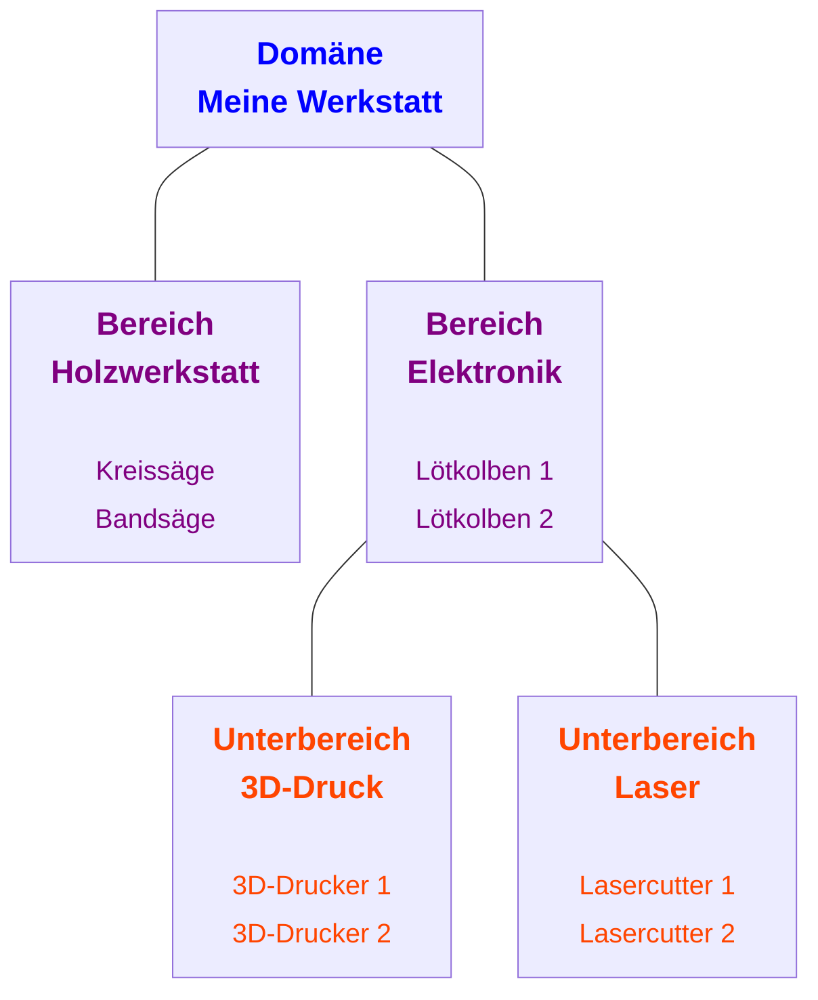
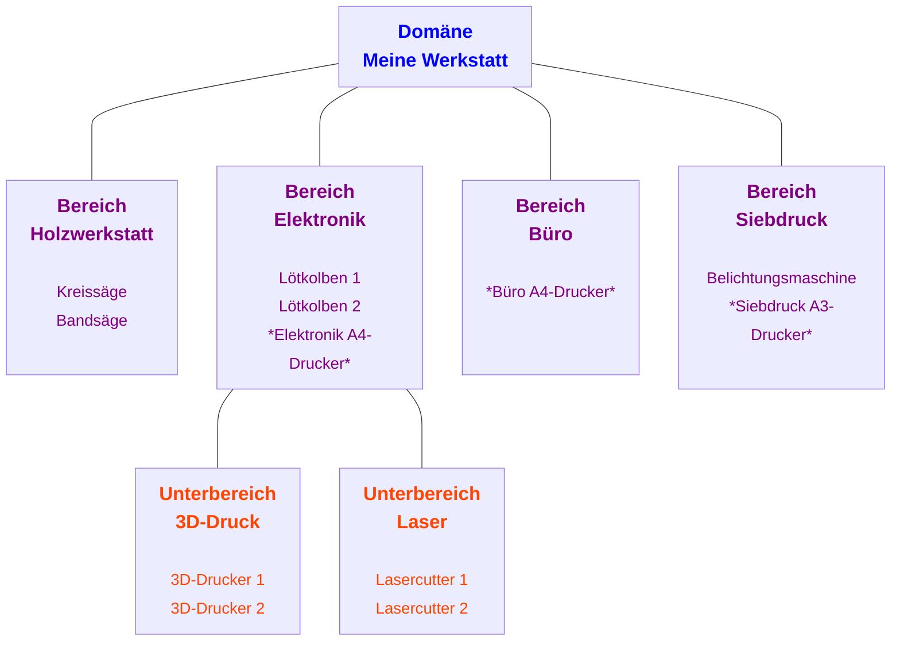

Der FabAccess Config Generator arbeitet mit einem Ordnungskonzept, um Werkstätten realitätsnah abzubilden und die Anzahl der erzeugten Rollen möglichst gering zu halten. Jede Maschine bzw. jedes Gerät wird einer Ordnungseinheit zugeordnet. Benutzerrollen werden anschließend nur für ganze Ordnungseinheiten vergeben.

Im Folgenden werden alle Konzepte/ Elemente anhand einer Beispielwerkstatt erläutert, die schrittweise erweitert wird. Dabei werfen wir auch einen ersten Blick auf die CSV-Daten, mit denen wir unsere Konfiguration anlegen.

## Ordnungskonzept

Das Ordnungskonzept beinhaltet die folgende Unterteilung:

| Element                                            | Zweck( Umfang)                                                  | Beinhaltet Maschinen |
| -------------------------------------------------- | ------------------------------------------------------ | -------------------- |
| <b>Domäne</b>            | Die ganze Werkstatt.                                   | :material-close:     |
| <b>Bereich</b>         | Ein Bereich/ Gewerk ein Werkstatt (z.B. Holzwerkstatt, Elektronik).          | :material-check:     |
| <b>Unterbereich</b> | Unterbereich eines Bereichs/ Gewerks (z.B. 3D-Druck im Elektronik). | :material-check:     |

Unter Nutzung dieser Elemente sieht unsere Beispielwerkstatt so aus:

 
Und die Benutzerrollen für unsere Werkstatt-Mitglieder würden wie folgt aussehen:

=== "Benutzerrollen"

    | Rolle                          | Zugriff auf Maschine/ Gerät                      |
    | ------------------------------ | ------------------------------------------------ |
    | Benutzer Holzwerkstatt         | <ul><li>Kreissäge</li><li>Bandsäge</li>          |
    | Benutzer Elektronik            | <ul><li>Lötkolben 1</li><li>Lötkolben 2</li>     |
    | Benutzer Elektronik - 3D-Druck | <ul><li>3D-Drucker 1</li><li>3D-Drucker 2</li>   |
    | Benutzer Elektronik - Laser    | <ul><li>Lasercutter 1</li><li>Lasercutter 2</li> |

=== "CSV-Daten (Auszug)"

     | Name Domäne | Name Bereich | Name Unterbereich | Name Maschine/ Gerät |
     | ------------------------------------- | ---------------------------------------- | ------------------------------------------------ | -------------------- |
     | Meine Werkstatt                       | Holzwerkstatt                            |                                                  | Bandsäge             |
     | Meine Werkstatt                       | Holzwerkstatt                            |                                                  | Kreissäge            |
     | Meine Werkstatt                       | Elektronik                               |                                                  | Lötkolben 1          |
     | Meine Werkstatt                       | Elektronik                               |                                                  | Lötkolben 2          |
     | Meine Werkstatt                       | Elektronik                               | 3D-Drucker                                       | 3D-Drucker 1         |
     | Meine Werkstatt                       | Elektronik                               | 3D-Drucker                                       | 3D-Drucker 2         |
     | Meine Werkstatt                       | Elektronik                               | Lasercutter                                      | Lasercutter 1        |
     | Meine Werkstatt                       | Elektronik                               | Lasercutter                                      | Lasercutter 2        |

!!! tip "Gültigkeitsbereich der Zugriffsrechte"
    Zugriffsrechte gelten immer nur für ihre jeweilige Ordnungseinheit, aber nicht für darunterliegende Ordnungseinheiten.

    In unserer Beispielwerkstatt kann eine Person mit der Benutzerrolle `Benutzer Elektronik` nur die beiden Lötkolben nutzen und hat keinen Zugriff auf die darunterliegenden Bereiche (3D-Druck, Laser).

## Rollenkonzept

### Administrator
Der klassische Administrator hat Vollzugriff auf alles im FabAccess.

| Ordnungseinheiten | FabAccess-Berechtigungen                             |
| ----------------- | ---------------------------------------------------- |
| Global            | bffh.users.manage, bffh.users.info, bffh.users.admin |

### Benutzer

Der Benutzer ist die klassische Benutzerrolle, die an Mitglieder der Werkstatt vergeben wird.

| Ordnungseinheiten                                                                      | FabAccess-Berechtigungen |
| -------------------------------------------------------------------------------------- | ------------------------ |
| - Bereich - Unterbereich | read, write, disclose    |

### Manager

In vielen Werkstätten gibt es nicht nur eine zentrale Verwaltungsperson, sondern auch Gewerkeleiter/ Bereichsleiter. Diese Zuständigkeit wird über die Manager-Rolle abgebildet.

Manager können in ihrer Ordnungseinheit die Maschinennutzung sperren/ freigeben, wenn sie dies für notwendig halten. Die Erstellung von Manager-Rollen ist optional.

| Ordnungseinheiten                                                                                                                    | FabAccess-Berechtigungen      |
| ------------------------------------------------------------------------------------------------------------------------------------ | ----------------------------- |
| - Global (optional) - Bereich  (optional) - Unterbereich (optional) | read, write, disclose, manage |

### Alternativrolle

Die Alternativrolle ist die Ausnahme von der Regel. Normalerweise werden Benutzerrollen für (Unter-)Bereiche, aber dies kann in manchen Fällen unpraktische Hürden schaffen. Beispielsweise könnten mehrere Bereiche über einen simplen A4-Drucker verfügen und es ist gewünscht, dass Mitglieder der Werkstatt die verschiedenen Drucker flexibel nutzen können. Dafür werden die Drucker an eine Alternativrolle gebunden.

| Ordnungseinheiten                 | FabAccess-Berechtigungen |
| --------------------------------- | ------------------------ |
| Keiner Ordnungseinheit zugeordnet. | read, write, disclose    |

## Erweiterte Beispielwerkstatt

Nachdem wir die verschiedenen Rollen kennengelernt haben, erweitern wir unsere Beispielwerkstatt. Unsere Beispielwerkstatt sieht nun so aus:

 
Dies sind die Eckdaten unserer erweiterten Werkstatt:

- Die verschiedene Ordnungseinheiten/ Gewerke werden jeweils von einer Person verwaltet.
- Im Bereich Elektronik gibt es zwei weitere Personen. Eine verwaltet ausschließlich die 3D-Drucker, die andere ausschließlich die Lasercutter. Hierfür gibt es Manager-Rollen für die jeweiligen Unterbereiche.
- Unsere Werkstatt wird von verschiedenen Schichtleitern betreut. Hierfür gibt es eine Manager-Rolle, welche Maschinen/ Geräte in der gesamten Domäne "*Meine Werkstatt*" verwalten kann.

=== "Rollen"

    | Rolle                          | Zugriff auf Maschine/ Gerät                                                                  | Rollentyp        |
    | ------------------------------ | -------------------------------------------------------------------------------------------- | ---------------- |
    | Administrator                  |                                                                                              | Administrator    |
    | Schichtleiter                  |                                                                                              | Manager (Domäne) |
    | Benutzer Holzwerkstatt         | <ul><li>Kreissäge</li><li>Bandsäge</li></ul>                                                 | Benutzer         |
    | Benutzer Elektronik            | <ul><li>Lötkolben 1</li><li>Lötkolben 2</li></ul>                                            | Benutzer         |
    | Benutzer Elektronik - 3D-Druck | <ul><li>3D-Drucker 1</li><li>3D-Drucker 2</li></ul>                                          | Benutzer         |
    | Benutzer Elektronik - Laser    | <ul><li>Lasercutter 1</li><li>Lasercutter 2</li></ul>                                        | Benutzer         |
    | Benutzer Druckernutzung        | <ul><li>Büro A4-Drucker</li><li>Elektronik A4-Drucker</li><li>Siebdruck A3-Drucker</li></ul> | Alternativrolle  |
    | Manager Holzwerkstatt          | <ul><li>Kreissäge</li><li>Bandsäge</li></ul>                                                 | Manager          |
    | Manager Elektronik             | <ul><li>Lötkolben 1</li><li>Lötkolben 2</li></ul>                                            | Manager          |
    | Manager Elektronik - 3D-Druck  | <ul><li>3D-Drucker 1</li><li>3D-Drucker 2</li></ul>                                          | Manager          |
    | Manager Elektronik - Laser     | <ul><li>Lasercutter 1</li><li>Lasercutter 2</li> </ul>                                       | Manager          |

=== "CSV-Daten (Auszug)"

     | Name Domäne | Name Bereich | Name Unterbereich | Maschine/ Gerät       | Name Alternativrolle | Manager erstellen |
     | ------------------------------------- | ---------------------------------------- | ------------------------------------------------ | --------------------- | -------------------- | ----------------- |
     | Meine Werkstatt                       | Holzwerkstatt                            |                                                  | Bandsäge              |                      | x                 |
     | Meine Werkstatt                       | Holzwerkstatt                            |                                                  | Kreissäge             |                      |                   |
     | Meine Werkstatt                       | Elektronik                               |                                                  | Lötkolben 1           |                      | x                 |
     | Meine Werkstatt                       | Elektronik                               |                                                  | Lötkolben 2           |                      |                   |
     | Meine Werkstatt                       | Elektronik                               |                                                  | Elektronik A4-Drucker | Druckernutzung       |                   |
     | Meine Werkstatt                       | Elektronik                               | 3D-Drucker                                       | 3D-Drucker 1          |                      |                   |
     | Meine Werkstatt                       | Elektronik                               | 3D-Drucker                                       | 3D-Drucker 2          |                      |                   |
     | Meine Werkstatt                       | Elektronik                               | Lasercutter                                      | Lasercutter 1         |                      | x                 |
     | Meine Werkstatt                       | Elektronik                               | Lasercutter                                      | Lasercutter 2         |                      |                   |
     | Meine Werkstatt                       | Büro                                     |                                                  | Büro A4-Drucker       | Druckernutzung       | x                 |
     | Meine Werkstatt                       | Siebdruck                                |                                                  | Siebdruck A3-Drucker  | Druckernutzung       |                   |

    !!! info

        Um einen Manager für einen (Unter-)Bereich zu erstellen, muss dies nur bei einer Maschine bzw. einem Gerät vermerkt werden.

